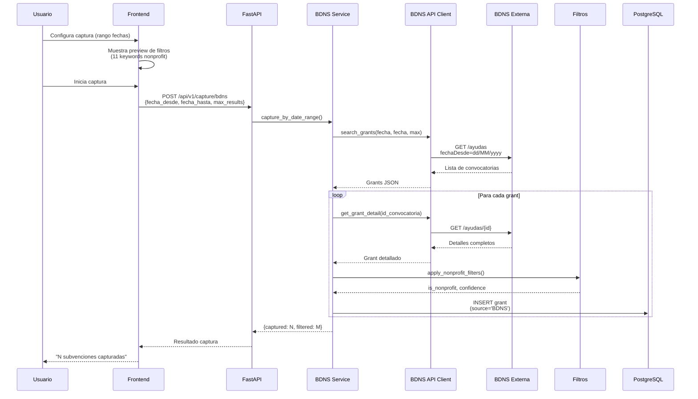
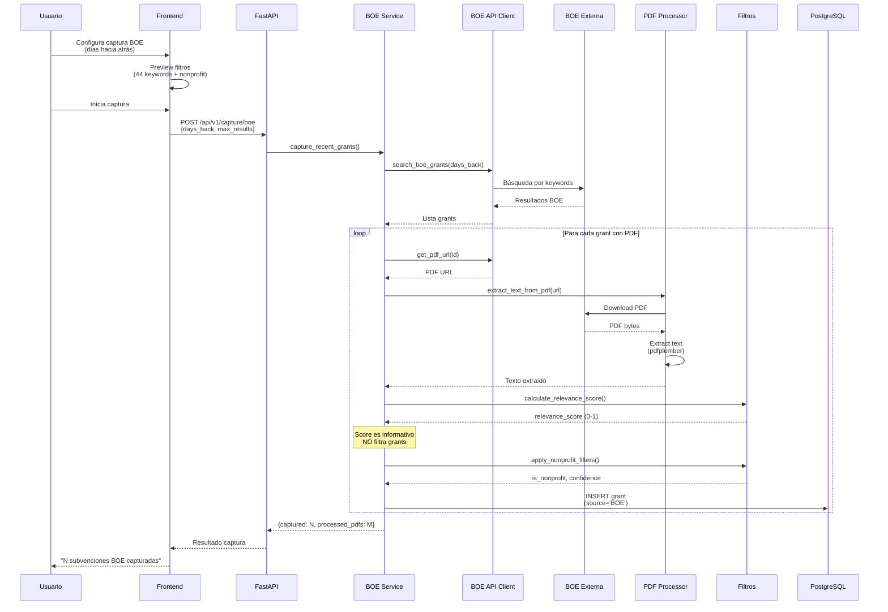
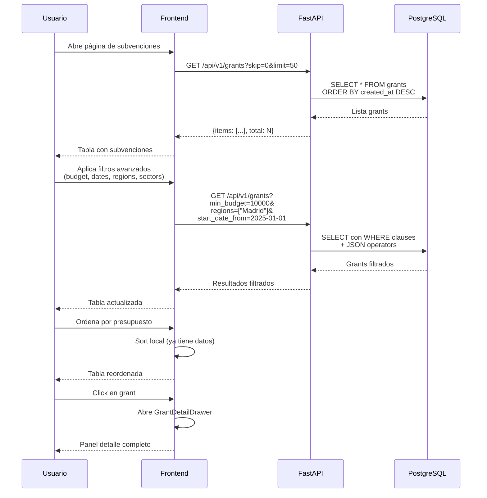
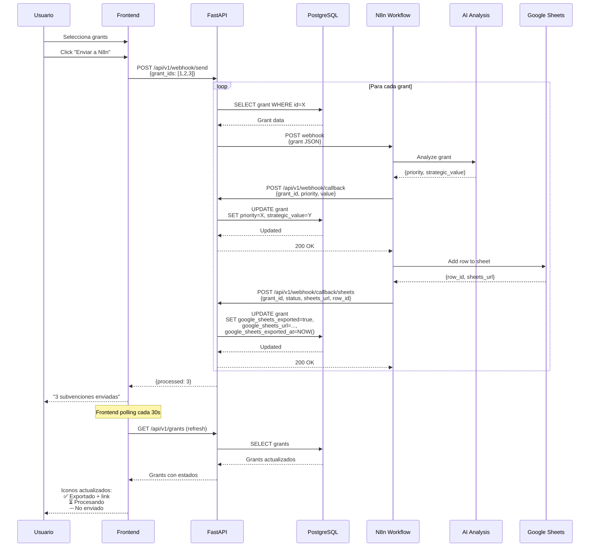
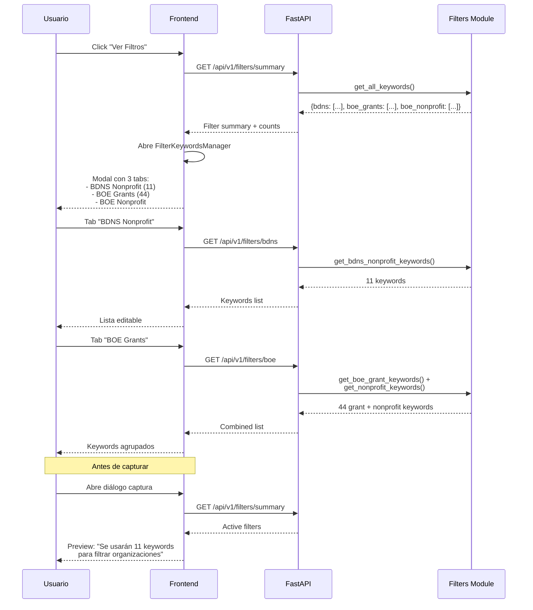
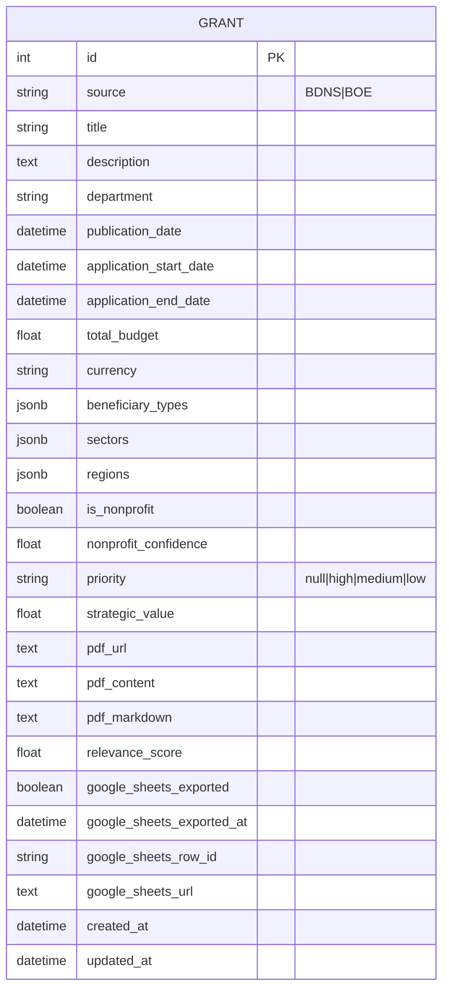

# Sistema de Subvenciones v1.0 - Arquitectura y Flujos

## Diagrama de Arquitectura General

```mermaid
graph TB
    subgraph "Frontend - React + Vite"
        UI[Interface de Usuario]
        GT[Tabla de Subvenciones]
        CD[Diálogo de Captura]
        FK[Gestor de Filtros]
        AN[Dashboard Analytics]
    end

    subgraph "Backend - FastAPI"
        subgraph "API Layer"
            API_G[/api/v1/grants]
            API_C[/api/v1/capture]
            API_W[/api/v1/webhook]
            API_F[/api/v1/filters]
            API_A[/api/v1/analytics]
        end

        subgraph "Service Layer"
            BDNS_S[BDNS Service]
            BOE_S[BOE Service]
            PDF_S[PDF Processor]
            N8N_S[N8n Service]
        end

        subgraph "Shared Modules"
            BDNS_API[BDNS API Client]
            BOE_API[BOE API Client]
            FILTERS[Filters & Keywords]
        end
    end

    subgraph "Database"
        PG[(PostgreSQL)]
    end

    subgraph "External APIs"
        BDNS_EXT[BDNS API<br/>Base Nacional]
        BOE_EXT[BOE API<br/>Boletín Oficial]
    end

    subgraph "Integration Layer"
        N8N[N8n Workflow<br/>AI Analysis]
        SHEETS[Google Sheets<br/>Export]
    end

    UI --> GT
    UI --> CD
    UI --> FK
    UI --> AN

    GT --> API_G
    CD --> API_C
    FK --> API_F
    AN --> API_A

    API_G --> PG
    API_C --> BDNS_S
    API_C --> BOE_S
    API_W --> PG
    API_F --> FILTERS
    API_A --> PG

    BDNS_S --> BDNS_API
    BDNS_S --> FILTERS
    BDNS_S --> PG

    BOE_S --> BOE_API
    BOE_S --> PDF_S
    BOE_S --> FILTERS
    BOE_S --> PG

    BDNS_API --> BDNS_EXT
    BOE_API --> BOE_EXT

    API_G --> N8N_S
    N8N_S --> N8N
    N8N --> API_W
    N8N --> SHEETS
    SHEETS --> API_W
```

## Flujo 1: Captura de Subvenciones BDNS



## Flujo 2: Captura de Subvenciones BOE



## Flujo 3: Consulta y Filtrado de Subvenciones



## Flujo 4: Integración N8n y Google Sheets (Bidireccional)



## Flujo 5: Gestión Transparente de Filtros



## Modelo de Datos: Grant



## Componentes Clave del Sistema

### Backend Services

1. **BDNS Service** (`bdns_service.py`)
   - Captura por rango de fechas
   - Filtrado automático por keywords nonprofit
   - Conversión formato fechas (ISO → dd/MM/yyyy)
   - Límites: 1-100 resultados por captura

2. **BOE Service** (`boe_service.py`)
   - Búsqueda por días hacia atrás
   - Procesamiento de PDFs
   - Cálculo de relevance_score (informativo)
   - Filtrado nonprofit + grant keywords

3. **PDF Processor** (`pdf_processor.py`)
   - Extracción con pdfplumber
   - Generación de markdown
   - Manejo de errores de encoding

4. **N8n Service** (`n8n_service.py` / `n8n_service_enhanced.py`)
   - Envío webhook básico
   - Versión mejorada: queue + retry + tracking

### Frontend Components

1. **GrantsTable** (`GrantsTable.tsx`)
   - Tabla con sorting local
   - Columnas: título, fuente, presupuesto, fechas, nonprofit, exportado
   - Selección múltiple para acciones batch
   - Indicadores visuales de estado de export

2. **CaptureConfigDialog** (`CaptureConfigDialog.tsx`)
   - Tabs para BDNS/BOE
   - BDNS: date pickers (from/to)
   - BOE: días hacia atrás
   - Preview de filtros activos

3. **FilterKeywordsManager** (`FilterKeywordsManager.tsx`)
   - 3 tabs: BDNS Nonprofit, BOE Grants, BOE Nonprofit
   - Vista de keywords activos
   - Edición futura

4. **GrantDetailDrawer** (`GrantDetailDrawer.tsx`)
   - Panel lateral con metadata completa
   - Visualización de análisis N8n
   - Links a PDFs y Google Sheets

### Shared Modules

1. **Filters** (`shared/filters.py`)
   - 11 keywords BDNS nonprofit
   - 44 keywords BOE grants
   - Lógica de matching case-insensitive
   - Cálculo de confidence scores

2. **BDNS API Client** (`shared/bdns_api.py`)
   - Wrapper de API BDNS
   - Búsqueda y detalle
   - Conversión de modelos Pydantic

3. **BOE API Client** (`shared/boe_api.py`)
   - Búsqueda en BOE
   - Descarga de PDFs
   - Parsing de XML/JSON

## Decisiones Arquitectónicas Clave

1. **Relevance Score es Informativo**: No filtra grants, solo informa al usuario
2. **Puerto PostgreSQL 5433**: Evita conflictos con otras instancias
3. **Filtros Transparentes**: Usuario ve y entiende qué criterios se aplican
4. **Webhooks Bidireccionales**: N8n → Backend (análisis) y N8n → Backend (export confirmación)
5. **Service Layer Pattern**: Lógica de negocio separada de API endpoints
6. **Vite Proxy**: Frontend y backend en puertos distintos con proxy transparente

## Próximos Pasos Sugeridos

1. Implementar export a Excel con cálculo de plazos
2. Permitir edición de keywords desde UI
3. Integrar notificaciones de nuevas subvenciones
4. Dashboard de analytics mejorado
5. Sistema de alertas personalizadas
